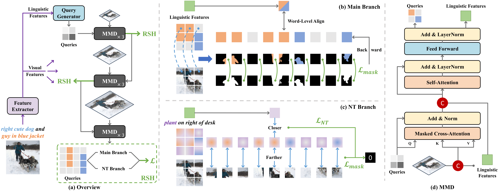

# Bring Adaptive Binding Prototypes to Generalized Referring Expression Segmentation

[](https://paperswithcode.com/sota/generalized-referring-expression-segmentation?p=bring-adaptive-binding-prototypes-to)

 **[📄[arXiv]](https://arxiv.org/abs/2405.15169)**

This repository contains code for **TMM** paper:
> [Bring Adaptive Binding Prototypes to Generalized Referring Expression Segmentation](https://arxiv.org/abs/2405.15169)  
> Weize Li, Haochen Bai, Zhicheng Zhao, Fei Su


<div align="center">
  
</div><br/>

## Update
- **(2025/04/02)** We have updated full codes.
- **(2024/09/27)** A simple version is released.

## Installation:

The code is tested under an environment that is almost the same as that of ReLA.

>Note: We use `PyTorch 2.3.1` and `CUDA 12.1` respectively. They are different from those in ReLA, but the configurations in ReLA are still applicable. 
>
>In addition, we recommend building `Detectron2` from source as described in [Docs](https://detectron2.readthedocs.io/en/latest/tutorials/install.html). It shares the same version `0.6` with the `pre-built` version, but there are significant differences, and it is compatible with newer versions of `PyTorch`.

1. Follow <a href="https://github.com/henghuiding/ReLA">RELA</a> to prepare environment

2. Prepare the dataset following [here](datasets/DATASET.md)

3. Download the best weights we provide in <a href="https://pan.baidu.com/s/1eroxdTSnGvihZs293ODEHg?pwd=ysjw" title="model">MABP_best</a>

4. Change the necessary items in the `configs/gres-MABP.yaml`.
## Inference

```
python train_net.py --config-file configs/gres-MABP.yaml --num-gpus 2 --dist-url auto MODEL.WEIGHTS [path to MABP_best.pth]   OUTPUT_DIR [output dir]
```
Then you can obtain the current best result of MABP:


| cIoU | gIoU | T_acc | N_acc | Pr@0.7 | Pr@0.8 | Pr@0.9 |
| :---:|:---:|:---:|:---:|:---:|:---:|:---:|
| 65.72 | 68.86 | 96.35 | 64.73 | 70.45 | 58.92 | 26.17 |

Note: This result is slightly higher than what we reported in our paper, primarily because we enhance the recall for no-target samples by taking the logical OR of the intermediate results of no-target indicators. 

Additionally, the results reported in the paper were based solely on the first no-target indicator, which was a bug caused by our oversight (using the last indicator or applying a logical OR would have been more reasonable). Unfortunately, it is regrettable that the paper on TMM cannot be corrected currently.

## Training

Firstly, download the backbone weights (`swin_base_patch4_window12_384_22k.pkl`) and convert it into detectron2 format using the script:

```
wget https://github.com/SwinTransformer/storage/releases/download/v1.0.0/swin_base_patch4_window12_384_22k.pth
python tools/convert-pretrained-swin-model-to-d2.py swin_base_patch4_window12_384_22k.pth swin_base_patch4_window12_384_22k.pkl
```

Then start training:
```
python train_net.py \
    --config-file configs/gres-MABP.yaml \
    --num-gpus 2 --dist-url auto \
    MODEL.WEIGHTS [path to weights] \
    OUTPUT_DIR [path to weights]
```

Note: In MABP, we modified and extended the default `WarmupCosineLR` of `Detectron2` to [`WarmupCosineRestartLR`](./gres_model/utils/WarmupCosineRestartLR.py). The relevant configurations can be found in `SOLVER` of `configs/gres-MABP.yaml`.

[`WarmupCosineRestartLR`](./gres_model/utils/WarmupCosineRestartLR.py) reduces the LR per epoch rather than per iteration (which causes inconsistent LR for different batches within the same epoch). Moreover, it supplements `WarmupCosineLR` with the restart function originally proposed in [SGDR](https://arxiv.org/abs/1608.03983) and a constant interval. 

However, the current default scheduler does not perform restarts. Its differences from `WarmupCosineLR` in `Detectron2` lie in the per-epoch decay and an initial constant interval. You can obtain the default form by changing `WarmupCosineRestartLR` to `WarmupCosineLR` in [config](./configs/Base-COCO-InstanceSegmentation.yaml). Alternatively, you can refer to the settings in `ReLA` and use the multistep decay method. For example:

```
SOLVER.LR_SCHEDULER_NAME WarmupCosineLR 
```

For the full list of base configs, see `configs/referring_R50.yaml` and `configs/Base-COCO-InstanceSegmentation.yaml`

## For single-object dataset
In fact, to apply MABP to a single-target dataset, it is only necessary to annotate out all the no-target branches. We have provided examples in our code, which can be found in ```gres_model\MABP-so.py```, ```gres_model\modeling\criterion-so.py```, and ```gres_model\modeling\transformer_decoder\referring_transformer_decoder-so.py```. 

Generally, after preparing the lmdb, modifying these three files along with the corresponding configuration files is sufficient to convert to a single-target MABP model.

## Acknowledgement

This project is based on [ReLA](https://github.com/henghuiding/ReLA), [refer](https://github.com/lichengunc/refer), [Mask2Former](https://github.com/facebookresearch/Mask2Former), [Detectron2](https://github.com/facebookresearch/detectron2), [VLT](https://github.com/henghuiding/Vision-Language-Transformer). Many thanks to the authors for their great works!


